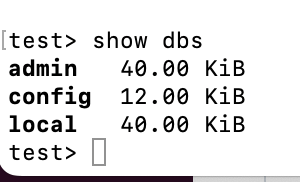
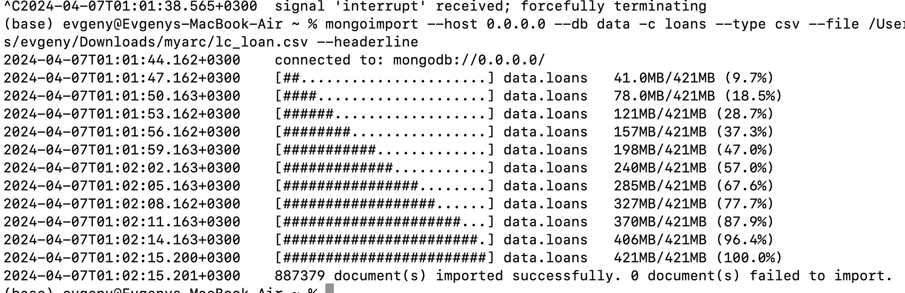
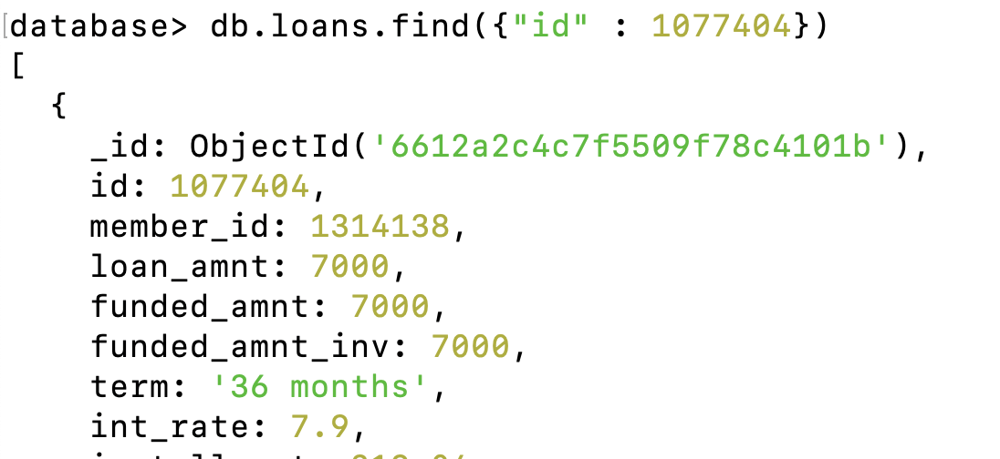
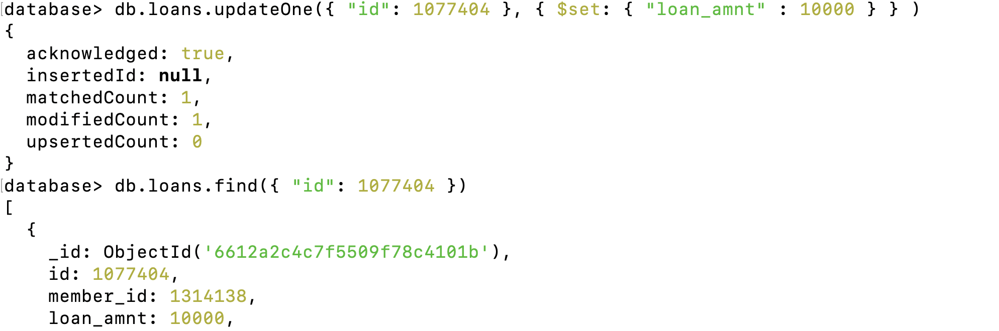
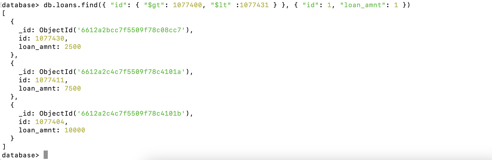
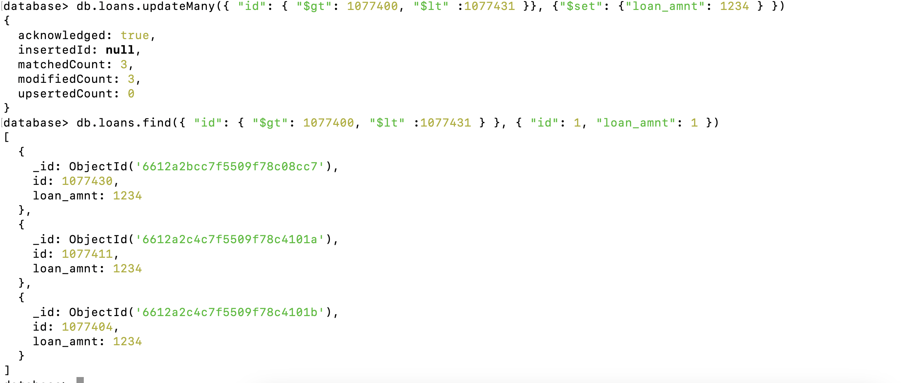
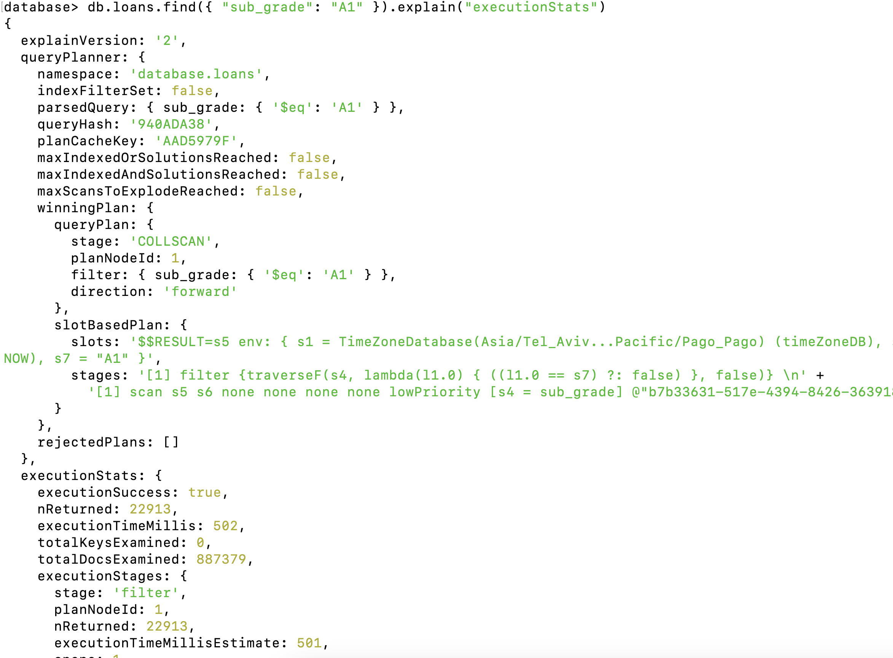
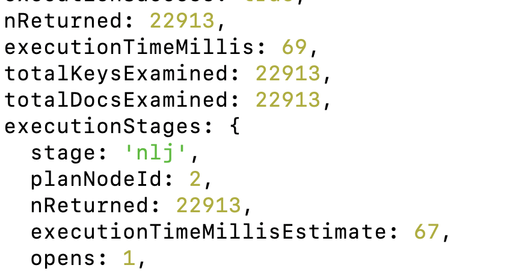

Отчет по MongoDB

csv файл взял с сайта kaggle

Я установил себе mongo локально, изначально у меня нет никаких баз

После чего я выгрузил данные

Появилась база

Я попробовал поиск и апдейт данных(updateOne)

Я попробовал поиск и апдейт данных(updateMany)

После чего произвел замер скорости нахождения данных без индекса(502 милискунд) 

И замер с добавлением индекса на искомое поле(69 милискунд)

Имеем значительное приращение в скорости работы за счет добавления индекса, обратим внимание, что результат работы одинаковый и находится одинаковое количество строк
